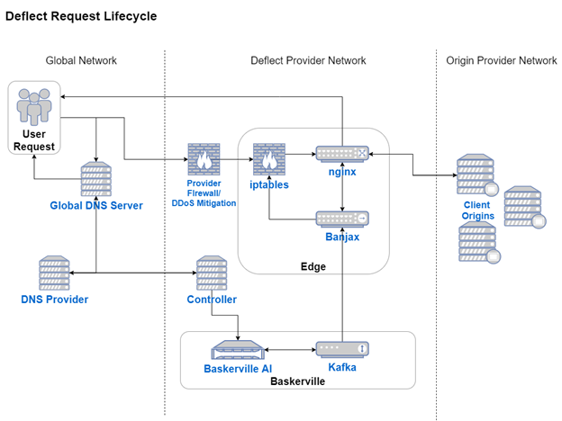

## Table of Contents
1. [What is Banjax](#what-is-banjax)
    1. [Backstory](#backstory)
    2. [Banjax-Go](#banjax-go)
    3. [Technology](#technology)
2. [How it Looks in a Deflect Environment](#how-it-looks-in-a-deflect-environment)
3. [Decision-Making Process](#decision-making-process)
4. [Password-protected paths](#password-protected-paths)
5. [Installation](#installation)
    1. [Talking to banjax-go from an existing Nginx (or other) setup](#talking-to-banjax-go-from-an-existing-nginx-or-other-setup)
    2. [Deploying Nginx + banjax-go in front of an existing web server](#deploying-nginx--banjax-go-in-front-of-an-existing-web-server)
    3. [Running the new Nginx + banjax-go on the same host as your existing server](#running-the-new-nginx--banjax-go-on-the-same-host-as-your-existing-server)
    4. [Running the new Nginx + banjax-go on a host other than your existing server](#running-the-new-nginx--banjax-go-on-a-host-other-than-your-existing-server)
6. [Talking to Baskerville over a Kafka connection](#talking-to-baskerville-over-a-kafka-connection)
7. [Sample Configuration](#sample-configuration)

# What is Banjax

## Backstory

Our edge architecture at Deflect for many years was Apache Trafficserver and a custom plugin called Banjax. This plugin did some basic rate-limiting on incoming requests according to a configurable set of regex patterns. If a rate-limit was exceeded, we could block further requests from that IP address, or we could serve a challenge-response page (JS-based proof-of-work, or password-based authentication).

This old plugin-based system was hooking Trafficserver&#39;s internal request-processing state machine events. This was quite hard to understand and extend, and the resulting behavior wasn&#39;t apparent or changeable in a config file.

## Banjax-Go

Banjax-go is a rewrite of this which performs the same functionality, but as a separate process rather than a plugin. We&#39;re also using it with Nginx now instead of Trafficserver, but the idea should work with any reverse proxy that supports X-Accel-Redirect. Instead of doing the regex matching on incoming requests in the Nginx/Trafficserver process, we are tailing access logs similarly to fail2ban.

Leveraging existing higher-level HTTP middleware concepts makes the whole thing easier to understand and modify. We can leverage Nginx&#39;s powerful block-based configuration format. Caching the auth request responses, adding timeout and failure-handling behavior, or treating static files specially can all be done in the Nginx config instead of with code.

## Technology

- [Go](https://golang.org/)
- [Docker](https://www.docker.com/) (each service/component is run in its own docker container)
- [Nginx](https://www.nginx.com/)
- [Kafka-server](https://hub.docker.com/r/wurstmeister/kafka/)
- [Baskerville](https://github.com/deflect-ca/baskerville)(optional, can be used together with Banjax to detect anomalous traffic)

# How it Looks in a Deflect Environment

The diagram below highlights the request life-cycle inside a fully-deployed Deflect DDoS infrastructure. Note the role of Banjax during a request life-cycle, and how it can also interact with other systems, such as Baskerville.



# Decision-Making Process

Banjax-go currently has four internal Decision types:

- Allow
- returns X-Accel-Redirect: @access\_granted to Nginx.
- NginxBlock
- returns X-Accel-Redirect: @access\_denied to Nginx.
- IptablesBlock
- returns @access\_denied _and also_ blocks that IP with iptables.
- Challenge
- returns a JS-based SHA-inverting proof-of-work page. if the request contains a cookie with a solved challenge, banjax-go returns @access\_granted. if an IP exceeds a rate limit of failed challenges, they get blocked.

The Decision lists are populated by:

- The config file. This is useful for allowlisting or blocklisting known good or bad IPs.
- The regex-matching rate-limiting log tailer. Rules specify the regex to look for, the number of hits and time interval that determine the rate limit, and the Decision to take for future requests from that IP if the rate limit is exceeded.
- A Kafka topic. This is how Baskerville sends its ML-informed commands to Banjax-go.
- A rate limit on the number of failed challenges an IP submits. Bots will generally fail a bunch of challenges, and we want to block them after a while rather than serve them an unlimited number of challenge pages.

Decisions added at run-time (from the log tailer, Kafka, or the failed challenge rate limit) expire after some configurable amount of time.

# Password-protected paths

From the perspective of the JS and cookie cryptographic implementation, these work very similarly to the SHA-inverting proof-of-work challenge. But the use-cases are different: the PoW challenge is intended to filter out DDoS traffic, and so it makes sense for the Nginx configuration to fail open in case Banjax-go is unreachable. Password-protected paths should fail closed.

# Installation

You should be able to get a quick demo of banjax-go + Nginx + a test origin server
running with `docker-compose up`.

You're probably running an existing Nginx (or similar) server. We describe two options
for adding banjax-go to your setup. The first involves changing your existing Nginx
configuration to talk to banjax-go. The second involves adding a new Nginx server in
front of your existing one.

## Talking to banjax-go from an existing Nginx (or other) setup

You'll want to read the sample `nginx.conf` under `supporting_containers/nginx` and understand
how it works.

An incoming request matches a location block like this. The `proxy_pass` directive
sends the request to banjax-go.
```
location / {
    proxy_pass http://127.0.0.1:8081/auth_request?;
}
```

banjax-go responds with one of:
* A challenge page containing JS that will set cookies for authenticating subsequent requests.
  This response gets sent back to the client.
* A response with `X-Accel-Redirect` set to `@access_granted` or `@access_denied`. This header
  tells Nginx not to respond to the client yet, but to perform an internal redirect to one
  of the location blocks called `@access_granted` or `@access_denied`.
```
location @access_denied {
    return 403 "access denied";
}

location @access_granted {
    proxy_pass http://test-origin:8080;
}
```

We're only using this with Nginx, but other proxy servers seem to have a similar mechanism.

## Deploying Nginx + banjax-go in front of an existing web server

The easiest way to get started here would be to edit the sample `nginx.conf` under
`supporting_containers/nginx` to point to your origin server (change all the
`proxy_pass http://test-origin:8080;` lines).

Then use the provided `docker-compose.yml` to start Dockerized instances of Nginx and
banjax-go: `docker-compose up --build nginx banjax-next`.

Now you can make a request through this new Nginx with:
```
curl --header "Host: example.com" http://127.0.0.1:80
```
or
```
curl --resolve example.com:80:127.0.0.1 http://127.0.0.1:80
```

For non-HTTPS requests like shown here, these commands will do the same thing
(namely, ensure an HTTP Host: header gets sent to Nginx so it knows which server
block to use). For HTTPS requests, the second form of the command will also ensure
the hostname gets sent in the TLS SNI field so that Nginx knows which server key to
use for the TLS connection. For a single-site Nginx configuration with
`server_name _;`, you might not have to worry about any of this.

## Running the new Nginx + banjax-go on the same host as your existing server

You'll want to change your existing server to listen on, for example, 127.0.0.1:8080, and
configure the new Nginx to `proxy_pass` to that local address.

Binding on 127.0.0.1 will let the new Nginx connect to it over the loopback interface,
but will keep others from being to connect to it over the internet.

Then configure the new Nginx to listen on 0.0.0.0:80 (and 443).

## Running the new Nginx + banjax-go on a host other than your existing server

You'll need to point your DNS records to the new host's IP address.

And you'll configure the new Nginx to point to your existing server's IP address and port.

And you'll want to use a firewall on the existing host to that only the new Nginx is allowed
to connect to it.

# Talking to Baskerville over a Kafka connection

banjax-go can optionally send and receive messages over a Kafka bus. We use this to
communicate with our Baskerville ML anomaly detection system.

Messages sent on `kafka_command_topic` (from Baskerville to banjax-go):
* `{"name": "challenge_ip", "value": "1.2.3.4"}`
  * Tells banjax-go to challenge this IP the next time it's seen.

Messages sent on `kafka_report_topic` (from banjax-go to Baskerville):
* `{"name": "ip_passed_challenge", "value_ip": "1.2.3.4", "value_site": "example.com"}`
  * Tells Baskerville an IP passed a challenge.
* `{"name": "ip_failed_challenge", [same as above]...}`
  * Tells Baskerville an IP failed a challenge.
* `{"name": "ip_banned", [same as above]...}`
  * Tells Baskerville an IP failed enough challenges to get banned.

The banning threshold is configured with:
```yaml
too_many_failed_challenges_interval_seconds: 10
too_many_failed_challenges_threshold: 3
```

The Kafka connection is configured with:
```yaml
kafka_brokers:
  - "localhost:9092"
kafka_security_protocol: 'ssl'
kafka_ssl_ca: "/etc/banjax/caroot.pem"
kafka_ssl_cert: "/etc/banjax/certificate.pem"
kafka_ssl_key: "/etc/banjax/key.pem"
kafka_ssl_key_password: password
kafka_report_topic: 'banjax_report_topic'
kafka_command_topic: 'banjax_command_topic'
```

# Sample Configuration

```yaml
config_version: 2020-12-15_12:35:38
global_decision_lists:         # static allow/challenge/block decisions (global)
  allow:
  - 20.20.20.20
  block:
  - 30.40.50.60
  challenge:
  - 8.8.8.8
per_site_decision_lists:       # static allow/challenge/block decisions (per-site)
  example.com:
    allow:
    - 20.20.20.20
    block:
    - 30.40.50.60
    challenge:
    - 8.8.8.8
iptables_ban_seconds: 10       # how long an iptables ban lasts
iptables_unbanner_seconds: 5   # how often the unbanning task runs
kafka_brokers:
- localhost:9092
password_hashes:               # for password_protected_paths
  example.com: <base64 string> 
password_protected_paths:      # for password_protected_paths
  example.com:
  - wp-admin
per_site_regexes_with_rates: # fail2ban-like challenging/blocking (per-site)
  example.com:
  - decision: block
    hits_per_interval: 10
    interval: 120
    name: UNNAMED RULE
    regex: 'GET \/search\/.*'
regexes_with_rates:            # fail2ban-like challenging/blocking (global)
- decision: block
  hits_per_interval: 0
  interval: 1
  regex: .*blockme.*
  rule: instant block
- decision: challenge
  hits_per_interval: 0
  interval: 1
  regex: .*challengeme.*
  rule: instant challenge
server_log_file: /var/log/banjax/banjax-format.log  # nginx log file with specific format
```

---

<a rel="license" href="http://creativecommons.org/licenses/by/4.0/">
</a><br />
This work is copyright (c) 2020, eQualit.ie inc., and is licensed under a <a rel="license" href="http://creativecommons.org/licenses/by/4.0/">Creative Commons Attribution 4.0 International License</a>.
